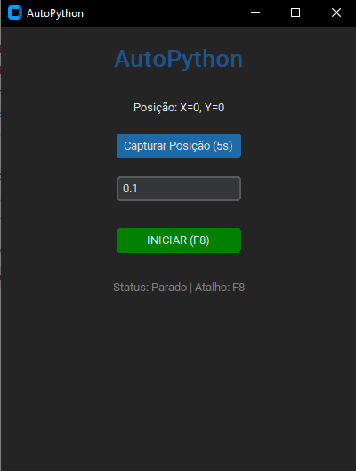

# 🖱️ AutoPython

**AutoPython** is a minimalist and modern auto-clicking utility developed in Python. It was designed to replace clunky terminal scripts with a professional Graphical User Interface (GUI), offering seamless control and a frustration-free experience.



## ✨ Key Features
- **Modern Interface:** Powered by `CustomTkinter` for a native Dark Mode aesthetic.
- **Panic Hotkey (F8):** Toggle clicking on or off instantly from anywhere, even if the window isn't focused.
- **Self-Bundler:** A unique "Generate EXE" button that compiles the script into a standalone executable using PyInstaller.
- **Safety Failsafe:** Built-in protection — move your mouse to the top-left corner of the screen to kill the process immediately.
- **Auto-Dependency Management:** The script automatically detects and installs missing libraries (`customtkinter`, `pyautogui`, `keyboard`, `pyinstaller`) on its first run.

## 🚀 Getting Started

### For Developers (Running via Python)
1. Ensure you have Python 3.x installed: https://www.python.org/
2. Clone this repository:
```bash
git clone https://github.com/vit-ops/autoClicker-using-Python.git
```
# Run the script:

python autoclik.py
For Users (Creating the Standalone .EXE)
Open the autoclik.py script.

Click the GENERATE APPLICATION (.EXE) button.

Wait for the process to complete.

A folder named dist will open automatically containing AutoPython.exe.

You can now move this file to any Windows machine without needing Python installed.

# ⚙️ How it Works
Capture Position: Click the capture button and you have 5 seconds to hover your mouse over the target area.

Set Interval: Enter the delay between clicks (e.g., 0.1 for 10 clicks per second).

Control: Use the START button or press F8 to toggle the clicking loop.

# 🛠️ Built With
Python 3.x

CustomTkinter – UI Design

PyAutoGUI – Mouse Automation

Keyboard – Global Hotkeys

PyInstaller – Compilation

# ⚠️ Important Notes
Antivirus Flags
Because the app hooks into keyboard events and controls the mouse, Windows Defender or other antivirus software may flag it as a false positive. You may need to select Run anyway.

Permissions
Some games or administrative windows may require you to run AutoPython as an Administrator for clicks and hotkeys to register correctly.
